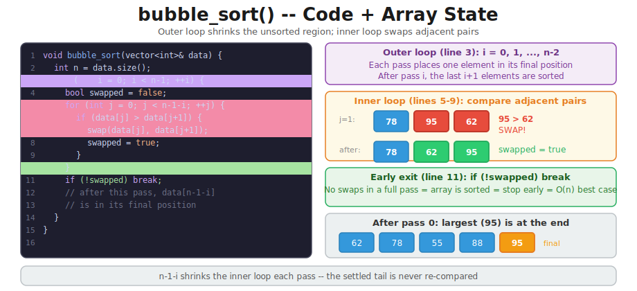
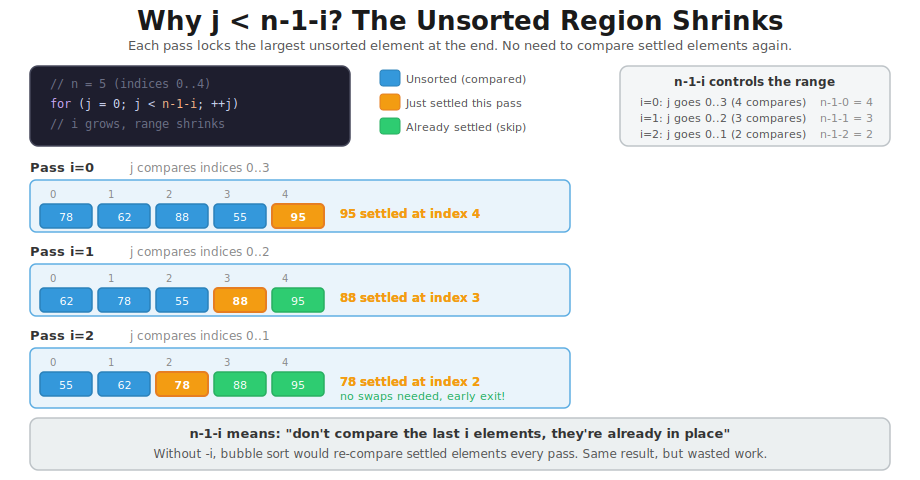
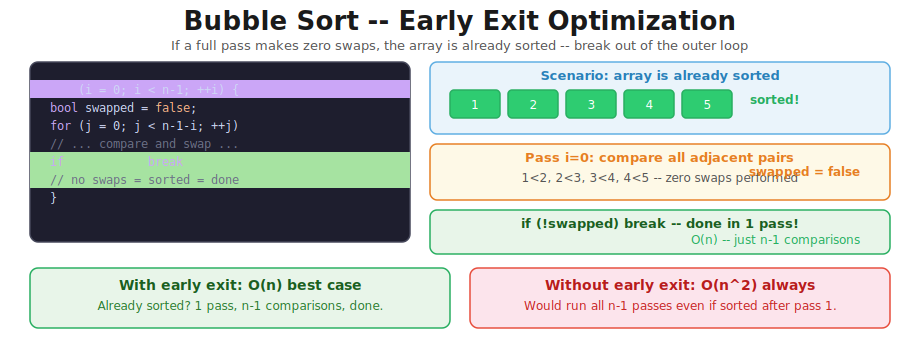
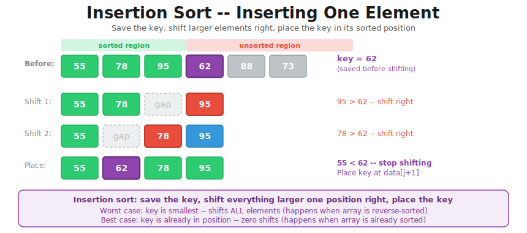
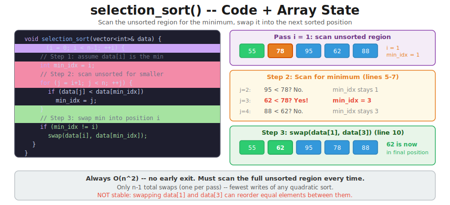
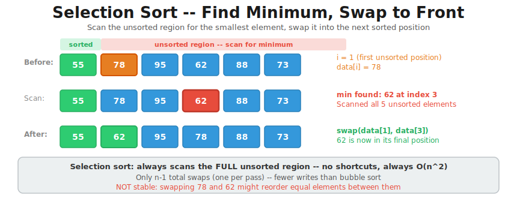

# CT12 -- Implementation Diagrams

Code-block diagrams referenced from `QuadraticSorts.cpp`.
Each diagram shows the code on the left and the array state on the right (CT11 style).

---

## 1. Bubble Sort -- Code + Array State
*`QuadraticSorts.cpp::bubble_sort()` -- outer loop shrinks unsorted region, inner loop swaps adjacent pairs, early exit if no swaps*

---

## 2. Why j < n-1-i? The Unsorted Region Shrinks
*`QuadraticSorts.cpp::bubble_sort()` -- each pass settles one more element at the end, so the inner loop range shrinks by 1*

---

## 3. Bubble Sort -- One Pass
*`QuadraticSorts.cpp::bubble_sort()` -- step-by-step pass showing 95 bubbling to the end*

---

## 4. Bubble Sort -- Early Exit Optimization
*`QuadraticSorts.cpp::bubble_sort()` -- no swaps in a full pass means the array is sorted*

---

## 5. Insertion Sort -- Code + Array State
*`QuadraticSorts.cpp::insertion_sort()` -- save key, shift larger elements right, place key in sorted position*

---

## 6. Insertion Sort -- Inserting One Element
*`QuadraticSorts.cpp::insertion_sort()` -- detailed step-by-step of shifting 95 and 78 right to place 62*

---

## 7. Selection Sort -- Code + Array State
*`QuadraticSorts.cpp::selection_sort()` -- scan for minimum, swap to front, always O(n^2)*

---

## 8. Selection Sort -- Find Minimum, Swap to Front
*`QuadraticSorts.cpp::selection_sort()` -- detailed step-by-step of scanning and swapping*

