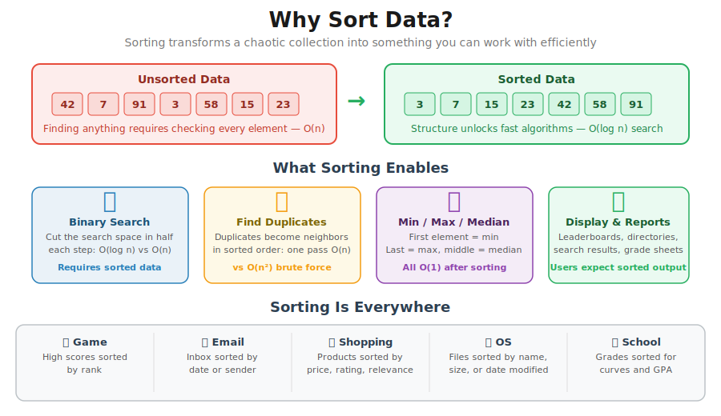
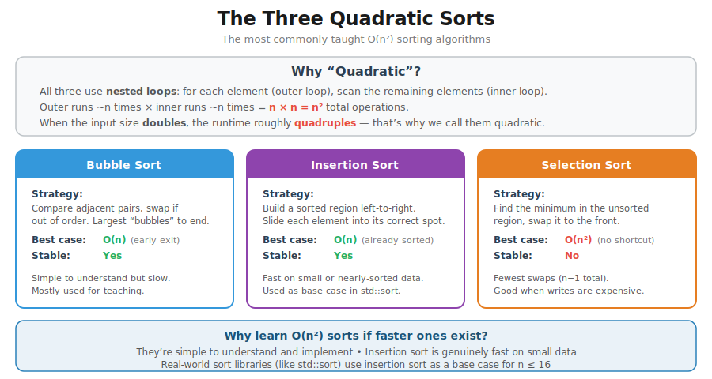
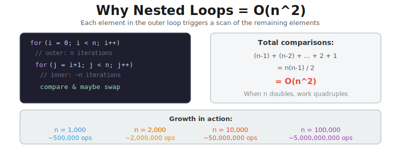
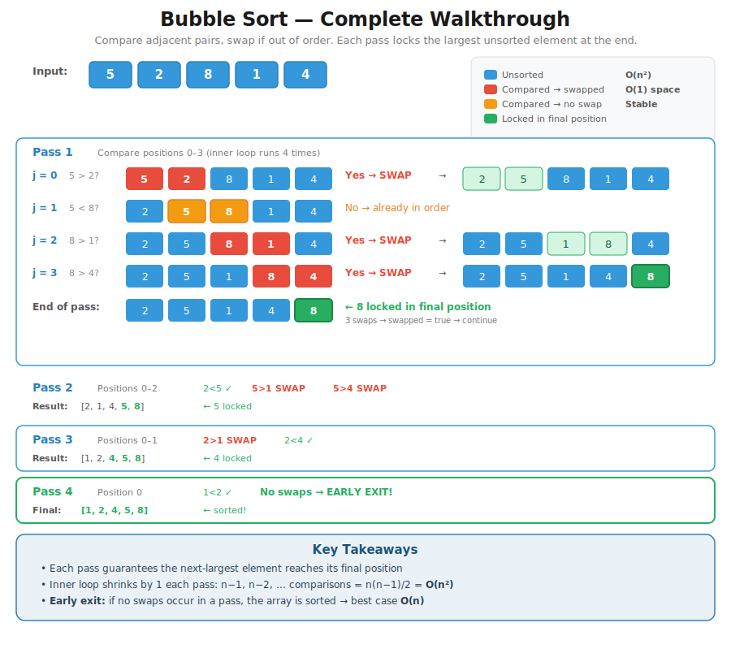
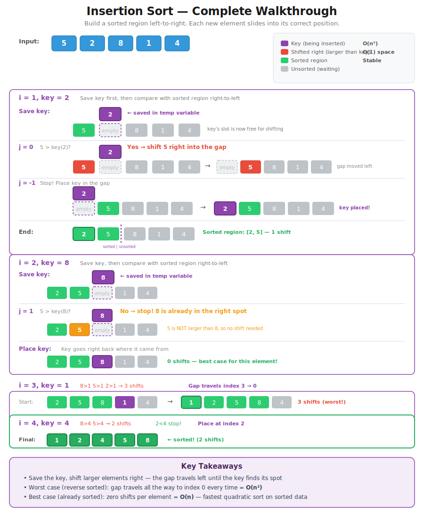
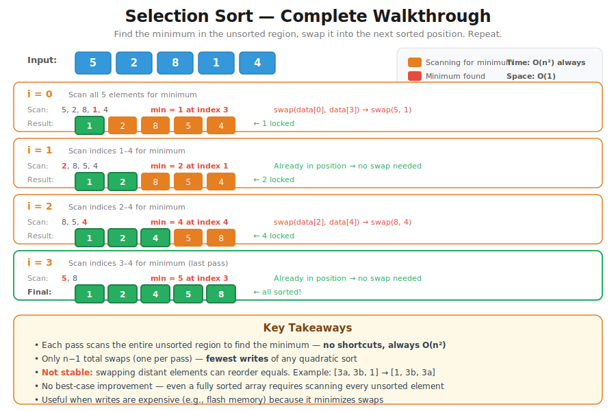
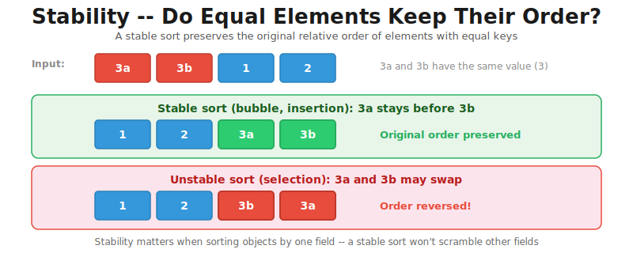
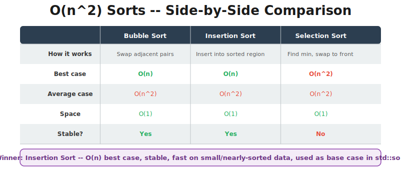

# CT12 -- Header Diagrams

Conceptual diagrams referenced from `QuadraticSorts.h`.

---

## 1. Why Sort Data?
*`QuadraticSorts.h` -- motivation: what sorting enables and where it shows up*

---

## 2. The Three Quadratic Sorts
*`QuadraticSorts.h` -- visual overview of all three O(n^2) sorts at a glance*

---

## 3. Why Nested Loops = O(n^2)
*`QuadraticSorts.h` -- nested loops, math breakdown, and O(n^2) growth curve*

---

## 4. Bubble Sort -- Complete Walkthrough
*`QuadraticSorts.h` -- every pass on [5, 2, 8, 1, 4] with early exit*

[Interactive demo: Bubble Sort in action (W3Schools)](https://www.w3schools.com/dsa/dsa_algo_bubblesort.php)

---

## 5. Insertion Sort -- Complete Walkthrough
*`QuadraticSorts.h` -- every insertion on [5, 2, 8, 1, 4] showing shifts*

---

## 6. Selection Sort -- Complete Walkthrough
*`QuadraticSorts.h` -- every pass on [5, 2, 8, 1, 4] showing min-find and swap*

---

## 7. Stability -- Do Equal Elements Keep Their Order?
*`QuadraticSorts.h` -- bubble and insertion are stable; selection is not*

---

## 8. O(n^2) Sorts -- Side-by-Side Comparison
*`QuadraticSorts.h` -- best case, average case, space, and stability at a glance*

